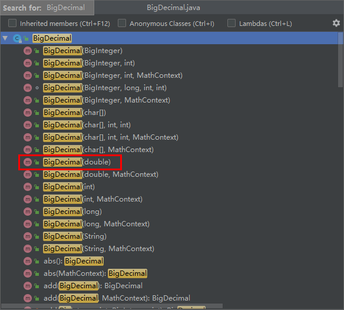
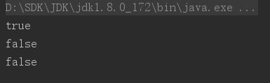
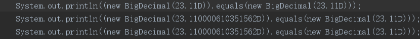

# JAVA BigDecimal 存在的坑

##### 浮点数比较,查看BigDecimalu源码

###### 

##### 通过BigDecimal构造方法我们得出浮点数仅存在一个double类型的构造方法，float类型的值会通过Java向上转型自动转换为double类型走double类型的构造方法，这么一个看下面三个比较返回的都是true。

```
System.out.println(new BigDecimal(23.11).equals((new BigDecimal(23.11))));
System.out.println(new BigDecimal(23.11F).equals((new BigDecimal(23.11))));
System.out.println(new BigDecimal(23.11F).equals((new BigDecimal(23.11D))));
```

##### 结果是：




##### 真实让人百思不得其解。。。。


当我查看编译后的class文件后， 一切问题将变得清晰明了起来



##### 原来是JAVAC编译器做的手脚， 拉出去砍了

### 结论

当使用浮点数类型初始化BigDecimal对象时,在需要构造相同BigDecimal对象时,得确保浮点数的类型保持一直.

比如:

```java
new BigDecimal(23.11).equals((new BigDecimal(23.11)))
new BigDecimal(23.11F).equals((new BigDecimal(23.11F)))
new BigDecimal(23.11D).equals((new BigDecimal(23.11D)))
```

这样避免javac在编译时的经过一系列优化导致预期结果不一致,排查尤为困难的情景.


