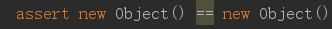

# JAVA 关键字 assert

##### 为什么assert 两个完全不相等的对象或者基本类型却不报错，例如图下

```java
assert new Object() == new Object();
assert 1 == 2;
```




##### 究其原因其实是jvm 启动未添加 -ea 参数用来开启断言

##### 一般来说，通过IDE开发工具（IDEA）在执行测试方式时会主动打开 -ea


##### 但如果没有使用这些工具将面临比较尴尬的困境， 而且问题比较隐蔽不容易察觉

##### 所以建议避免使用assert执行测试方法，改用Junit Assertions.assert*（）执行测试方法

